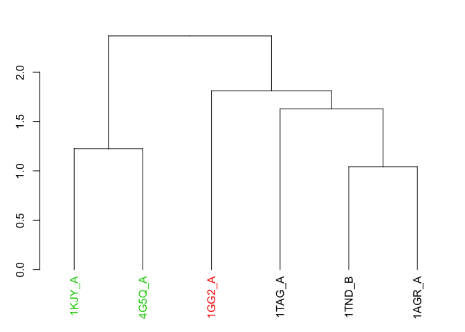

Class 11 Section 3 Onward
================

``` r
#knitr::knit_hooks$set(webgl = hook_webgl)
knitr::knit_hooks$set(rgl = function(before, options, envir) {
  if (!before) {
    ## after a chunk has been evaluated
    if (rgl.cur() == 0) return()  # no active device
    name = paste(options$fig.path, options$label, sep = '')
    rgl.snapshot(paste(name, '.png', sep = ''), fmt = 'png')
    return(paste('\\includegraphics{', name, '}\n', sep = ''))
  }
})
```

Bio3D Class 11
--------------

If you don't have the [bio3d package](http://thegrantlab.org/bio3d/) available then you will need to do a one-time-only install from within R like so:

``` r
install.packages("bio3d")
```

Now we are sure we have the package lets load it and read some PDB files for analysis. Note in the code-block below we can add the option `warning=FALSE` to turn off the printing of the warning msg about files already existing.

``` r
library(bio3d)

# Download some example PDB files 
ids <- c("1TND_B","1AGR_A","1TAG_A","1GG2_A","1KJY_A","4G5Q_A")
files <- get.pdb(ids, split = TRUE)
```

Lets align these structures with the `pdbaln()` function and print a summary of the output.

``` r
# Extract and align the chains we are interested in  
pdbs <- pdbaln(files, fit = TRUE)
```

    ## Reading PDB files:
    ## ./split_chain/1TND_B.pdb
    ## ./split_chain/1AGR_A.pdb
    ## ./split_chain/1TAG_A.pdb
    ## ./split_chain/1GG2_A.pdb
    ## ./split_chain/1KJY_A.pdb
    ## ./split_chain/4G5Q_A.pdb
    ## .....   PDB has ALT records, taking A only, rm.alt=TRUE
    ## .
    ## 
    ## Extracting sequences
    ## 
    ## pdb/seq: 1   name: ./split_chain/1TND_B.pdb 
    ## pdb/seq: 2   name: ./split_chain/1AGR_A.pdb 
    ## pdb/seq: 3   name: ./split_chain/1TAG_A.pdb 
    ## pdb/seq: 4   name: ./split_chain/1GG2_A.pdb 
    ## pdb/seq: 5   name: ./split_chain/1KJY_A.pdb 
    ## pdb/seq: 6   name: ./split_chain/4G5Q_A.pdb 
    ##    PDB has ALT records, taking A only, rm.alt=TRUE

``` r
pdbs
```

    ##                                1        .         .         .         .         50 
    ## [Truncated_Name:1]1TND_B.pdb   --------------------------ARTVKLLLLGAGESGKSTIVKQMK
    ## [Truncated_Name:2]1AGR_A.pdb   LSAEDKAAVERSKMIDRNLREDGEKAAREVKLLLLGAGESGKSTIVKQMK
    ## [Truncated_Name:3]1TAG_A.pdb   --------------------------ARTVKLLLLGAGESGKSTIVKQMK
    ## [Truncated_Name:4]1GG2_A.pdb   LSAEDKAAVERSKMIDRNLREDGEKAAREVKLLLLGAGESGKSTIVKQMK
    ## [Truncated_Name:5]1KJY_A.pdb   -------------------------GAREVKLLLLGAGESGKSTIVKQMK
    ## [Truncated_Name:6]4G5Q_A.pdb   --------------------------AREVKLLLLGAGESGKSTIVKQMK
    ##                                                          ** ********************* 
    ##                                1        .         .         .         .         50 
    ## 
    ##                               51        .         .         .         .         100 
    ## [Truncated_Name:1]1TND_B.pdb   IIHQDGYSLEECLEFIAIIYGNTLQSILAIVRAMTTLNIQYGDSARQDDA
    ## [Truncated_Name:2]1AGR_A.pdb   IIHEAGYSEEECKQYKAVVYSNTIQSIIAIIRAMGRLKIDFGDAARADDA
    ## [Truncated_Name:3]1TAG_A.pdb   IIHQDGYSLEECLEFIAIIYGNTLQSILAIVRAMTTLNIQYGDSARQDDA
    ## [Truncated_Name:4]1GG2_A.pdb   IIHEAGYSEEECKQYKAVVYSNTIQSIIAIIRAMGRLKIDFGDAARADDA
    ## [Truncated_Name:5]1KJY_A.pdb   IIHEAGYSEEECKQYKAVVYSNTIQSIIAIIRAMGRLKIDFGDSARADDA
    ## [Truncated_Name:6]4G5Q_A.pdb   IIHEAGYSEEECKQYKAVVYSNTIQSIIAIIRAMGRLKIDFGDSARADDA
    ##                                ***  *** ***  ^ *^^* **^***^**^***  * * ^** ** *** 
    ##                               51        .         .         .         .         100 
    ## 
    ##                              101        .         .         .         .         150 
    ## [Truncated_Name:1]1TND_B.pdb   RKLMHMADTIEEGTMPKEMSDIIQRLWKDSGIQACFDRASEYQLNDSAGY
    ## [Truncated_Name:2]1AGR_A.pdb   RQLFVLAGAAEEGFMTAELAGVIKRLWKDSGVQACFNRSREYQLNDSAAY
    ## [Truncated_Name:3]1TAG_A.pdb   RKLMHMADTIEEGTMPKEMSDIIQRLWKDSGIQACFDRASEYQLNDSAGY
    ## [Truncated_Name:4]1GG2_A.pdb   RQLFVLAGAAEEGFMTAELAGVIKRLWKDSGVQACFNRSREYQLNDSAAY
    ## [Truncated_Name:5]1KJY_A.pdb   RQLFVLAGAAEEGFMTAELAGVIKRLWKDSGVQACFNRSREYQLNDSAAY
    ## [Truncated_Name:6]4G5Q_A.pdb   RQLFVLAGAAEEGFMTAELAGVIKRLWKDSGVQACFNRSREYQLNDSAAY
    ##                                * *  ^*   *** *  *^  ^* *******^**** *  ********^* 
    ##                              101        .         .         .         .         150 
    ## 
    ##                              151        .         .         .         .         200 
    ## [Truncated_Name:1]1TND_B.pdb   YLSDLERLVTPGYVPTEQDVLRSRVKTTGIIETQFSFKDLNFRMFDVGGQ
    ## [Truncated_Name:2]1AGR_A.pdb   YLNDLDRIAQPNYIPTQQDVLRTRVKTTGIVETHFTFKDLHFKMFDVGGQ
    ## [Truncated_Name:3]1TAG_A.pdb   YLSDLERLVTPGYVPTEQDVLRSRVKTTGIIETQFSFKDLNFRMFDVGGQ
    ## [Truncated_Name:4]1GG2_A.pdb   YLNDLDRIAQPNYIPTQQDVLRTRVKTTGIVETHFTFKDLHFKMFDVGAQ
    ## [Truncated_Name:5]1KJY_A.pdb   YLNDLDRIAQPNYIPTQQDVLRTRVKTTGIVETHFTFKDLHFKMFDVGGQ
    ## [Truncated_Name:6]4G5Q_A.pdb   YLNDLDRIAQPNYIPTQQDVLRTRVKTTGIVETHFTFKDLHFKMFDVGGQ
    ##                                ** **^*^  * *^** *****^*******^** *^**** *^*****^* 
    ##                              151        .         .         .         .         200 
    ## 
    ##                              201        .         .         .         .         250 
    ## [Truncated_Name:1]1TND_B.pdb   RSERKKWIHCFEGVTCIIFIAALSAYDMVLVEDDEVNRMHESLHLFNSIC
    ## [Truncated_Name:2]1AGR_A.pdb   RSERKKWIHCFEGVTAIIFCVALSDYDLVLAEDEEMNRMHESMKLFDSIC
    ## [Truncated_Name:3]1TAG_A.pdb   RSERKKWIHCFEGVTCIIFIAALSAYDMVLVEDDEVNRMHESLHLFNSIC
    ## [Truncated_Name:4]1GG2_A.pdb   RSERKKWIHCFEGVTAIIFCVALSDYDLVLAEDEEMNRMHESMKLFDSIC
    ## [Truncated_Name:5]1KJY_A.pdb   RSERKKWIHCFEGVTAIIFCVALSDYDLVLAEDEEMNRMHESMKLFDSIC
    ## [Truncated_Name:6]4G5Q_A.pdb   RSERKKWIHCFEGVTAIIFCVALSDYDLVLAEDEEMNRMHESMKLFDSIC
    ##                                *************** ***  *** **^** **^*^******^^** *** 
    ##                              201        .         .         .         .         250 
    ## 
    ##                              251        .         .         .         .         300 
    ## [Truncated_Name:1]1TND_B.pdb   NHRYFATTSIVLFLNKKDVFSEKIKKAHLSICFPDYNGPNTYEDAGNYIK
    ## [Truncated_Name:2]1AGR_A.pdb   NNKWFTDTSIILFLNKKDLFEEKIKKSPLTICYPEYAGSNTYEEAAAYIQ
    ## [Truncated_Name:3]1TAG_A.pdb   NHRYFATTSIVLFLNKKDVFSEKIKKAHLSICFPDYNGPNTYEDAGNYIK
    ## [Truncated_Name:4]1GG2_A.pdb   NNKWFTDTSIILFLNKKDLFEEKIKKSPLTICYPEYAGSNTYEEAAAYIQ
    ## [Truncated_Name:5]1KJY_A.pdb   NNKWFTDTSIILFLNKKDLFEEKIKKSPLTICYPEYAGSNTYEEAAAYIQ
    ## [Truncated_Name:6]4G5Q_A.pdb   NNKWFTDTSIILFLNKKDLFEEKIKKSPLTICYPEYAGSNTYEEAAAYIQ
    ##                                * ^^*  ***^*******^* *****  *^**^*^* * ****^*^ **  
    ##                              251        .         .         .         .         300 
    ## 
    ##                              301        .         .         .         .         350 
    ## [Truncated_Name:1]1TND_B.pdb   VQFLELNMRRDVKEIYSHMTCATDTQNVKFVFDAVTDIIIKE--------
    ## [Truncated_Name:2]1AGR_A.pdb   CQFEDLNKRKDTKEIYTHFTCATDTKNVQFVFDAVTDVIIKNNLKDCGLF
    ## [Truncated_Name:3]1TAG_A.pdb   VQFLELNMRRDVKEIYSHMTCATDTQNVKFVFDAVTDIII----------
    ## [Truncated_Name:4]1GG2_A.pdb   CQFEDLNKRKDTKEIYTHFTCATDTKNVQFVFDAVTDVIIKNNL------
    ## [Truncated_Name:5]1KJY_A.pdb   CQFEDLNKRKDTKEIYTHFTCATDTKNVQFVFDAVTDVIIKNNLK-----
    ## [Truncated_Name:6]4G5Q_A.pdb   CQFEDLNKRKDTKEIYTHFTCATDTKNVQFVFDAVTDVIIKNNLKD----
    ##                                 ** ^** *^* ****^* ****** ** ********^**           
    ##                              301        .         .         .         .         350 
    ## 
    ## Call:
    ##   pdbaln(files = files, fit = TRUE)
    ## 
    ## Class:
    ##   pdbs, fasta
    ## 
    ## Alignment dimensions:
    ##   6 sequence rows; 350 position columns (314 non-gap, 36 gap) 
    ## 
    ## + attr: xyz, resno, b, chain, id, ali, resid, sse, call

I wonder how this call will work

``` r
aln2html(pdbs)
```

Can we see the results [alignment.html](alignment.html)

### Sequence analysis

Lets try some basic things...

``` r
# Calculate sequence 
identity <- seqidentity(pdbs)
identity
```

    ##                          ./split_chain/1TND_B.pdb ./split_chain/1AGR_A.pdb
    ## ./split_chain/1TND_B.pdb                    1.000                    0.693
    ## ./split_chain/1AGR_A.pdb                    0.693                    1.000
    ## ./split_chain/1TAG_A.pdb                    1.000                    0.694
    ## ./split_chain/1GG2_A.pdb                    0.690                    0.997
    ## ./split_chain/1KJY_A.pdb                    0.696                    0.994
    ## ./split_chain/4G5Q_A.pdb                    0.696                    0.997
    ##                          ./split_chain/1TAG_A.pdb ./split_chain/1GG2_A.pdb
    ## ./split_chain/1TND_B.pdb                    1.000                    0.690
    ## ./split_chain/1AGR_A.pdb                    0.694                    0.997
    ## ./split_chain/1TAG_A.pdb                    1.000                    0.691
    ## ./split_chain/1GG2_A.pdb                    0.691                    1.000
    ## ./split_chain/1KJY_A.pdb                    0.697                    0.991
    ## ./split_chain/4G5Q_A.pdb                    0.697                    0.994
    ##                          ./split_chain/1KJY_A.pdb ./split_chain/4G5Q_A.pdb
    ## ./split_chain/1TND_B.pdb                    0.696                    0.696
    ## ./split_chain/1AGR_A.pdb                    0.994                    0.997
    ## ./split_chain/1TAG_A.pdb                    0.697                    0.697
    ## ./split_chain/1GG2_A.pdb                    0.991                    0.994
    ## ./split_chain/1KJY_A.pdb                    1.000                    1.000
    ## ./split_chain/4G5Q_A.pdb                    1.000                    1.000

and RMSD

``` r
# Calculate RMSD  
rd <- rmsd(pdbs)   
```

    ## Warning in rmsd(pdbs): No indices provided, using the 314 non NA positions

Lets add some names to our RMSD matrix for convenience

``` r
rownames(rd) <- basename.pdb(pdbs$id)
colnames(rd) <- basename.pdb(pdbs$id)
rd
```

    ##        1TND_B 1AGR_A 1TAG_A 1GG2_A 1KJY_A 4G5Q_A
    ## 1TND_B  0.000  1.042  1.281  1.651  2.098  2.367
    ## 1AGR_A  1.042  0.000  1.628  1.811  1.949  2.244
    ## 1TAG_A  1.281  1.628  0.000  1.730  1.840  1.885
    ## 1GG2_A  1.651  1.811  1.730  0.000  1.901  2.032
    ## 1KJY_A  2.098  1.949  1.840  1.901  0.000  1.225
    ## 4G5Q_A  2.367  2.244  1.885  2.032  1.225  0.000

And cluster into 2 or 3 grps?

``` r
# Clustering  
hc <- hclust(as.dist(rd))  
grps <- cutree(hc, k=3) 
```

and a plot...

``` r
# Plot results as dendrogram  
hclustplot(hc, k=3)
```



and try a fancy heatmap

``` r
library(pheatmap)
pheatmap(rd)
```


Play with colors and add a little gap for our first clear grp

``` r
co <- colorRampPalette( c("white", "firebrick3"))
pheatmap(rd, color = co(15), cutree_row = 2, cutree_col = 2)
```


and some sequence conservation analysis

``` r
x <- conserv(pdbs)
plot(x, typ="h", xlab="Alignment Position", ylab="Conservation")
```


PCA example
-----------

Now for some PCA of these structures

``` r
pc <- pca(pdbs, rm.gaps=TRUE)
plot(pc, col=grps)
```


And a 3D plot

``` r
library(rgl)
```

    ## Warning: package 'rgl' was built under R version 3.4.3

``` r
plot3d(pc$z[,1], pc$z[,2], pc$z[,3], col=grps, type="s")
```
